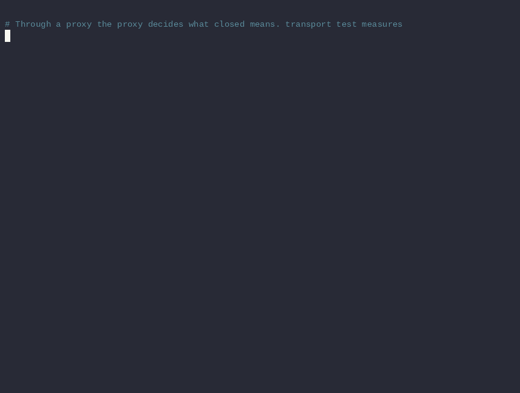

<p align="center">
  
</p>

<h1 align="center">scanr</h1>

<p align="center">
  <strong>Scan through the path you actually use.</strong><br>
  Proxy-native TCP connect scanning, with receipts.
</p>

<p align="center">
  <a href="https://github.com/0typos/scanr/actions/workflows/ci.yml"></a>
  <a href="https://github.com/0typos/scanr/releases"></a>
  
  <a href="Cargo.toml"></a>
</p>

<p align="center">
  <a href="#install">Install</a> ·
  <a href="#first-scan">First scan</a> ·
  <a href="#ask-the-proxy">Proxy fidelity</a> ·
  <a href="#leave-receipts">Records</a> ·
  <a href="#documentation">Docs</a>
</p>

> **Routes get weird. Records shouldn't.**

`scanr` is an unprivileged TCP connect scanner built for real network paths: direct,
SOCKS5, HTTP CONNECT, chains and pools. Open ports stream to stdout. Every run leaves a
verifiable JSONL record containing the resolved configuration, the probe accounting and
exactly one terminal event.

Roughly `nmap -Pn -sT -n -v --open -T4`, but proxy-native and config-first.

## At a glance

| 🧭 Route it | 🔎 Trust it | 🧾 Keep it |
|---|---|---|
| SOCKS5, HTTP CONNECT, chains and stable pools | Measures what the proxy can actually classify | Gzip JSONL record with config, seed and terminal state |
| Remote DNS stays remote | Never invents `closed` when the proxy only knows “not open” | Verify, summarize, filter or resume later |

## See it work

<p align="center">
  
</p>

<p align="center">
  <sub>Measuring SOCKS5 fidelity, then scanning through <code>ssh -D</code>. <a href="docs/tutorial.md">Run the full tutorial</a> or <a href="docs/tutorial/demos/05-socks5.cast">play the terminal cast</a>.</sub>
</p>

## Install

### Release binary

Each [GitHub release](https://github.com/0typos/scanr/releases) includes a checksum next
to every archive. The static musl build needs no system libc:

```console
tag=v1.0.0-rc.7 target=x86_64-unknown-linux-musl
curl -LO "https://github.com/0typos/scanr/releases/download/$tag/scanr-$tag-$target.tar.gz"{,.sha256}
sha256sum -c "scanr-$tag-$target.tar.gz.sha256" && tar -xzf "scanr-$tag-$target.tar.gz"
./scanr-$tag-$target/scanr --version
```

### From source

```console
cargo install --git https://github.com/0typos/scanr --locked
```

<details>
<summary><strong>Release targets and local builds</strong></summary>

Eight Linux targets ship on every release:

| libc | targets |
|---|---|
| glibc | `x86_64-unknown-linux-gnu`, `aarch64-unknown-linux-gnu` |
| static musl | `x86_64-unknown-linux-musl`, `aarch64-unknown-linux-musl`, `armv7-unknown-linux-musleabihf`, `i686-unknown-linux-musl`, `riscv64gc-unknown-linux-musl`, `powerpc64le-unknown-linux-musl` |

```console
cargo build --release                                      # native
cargo build --release --target x86_64-unknown-linux-musl   # static PIE
./scripts/build-all.sh                                     # all eight, with cargo-zigbuild
```

Linux x86_64 gnu and musl run the full suite. Other release targets are smoke-run under
emulation. macOS builds and passes CI; Windows is not planned. See
[stability](docs/stability.md#not-promised) for the support boundary.

</details>

## First scan

Start with a named, reviewable scan:

```console
scanr config init          # write an annotated scanr.toml
scanr config validate
scanr plan internal-web    # resolve everything; send no traffic
scanr run internal-web
```

Or go ad hoc:

```console
scanr run --targets 10.20.30.0/24 --ports 22,80,443
scanr run --targets hosts.txt --ports 1-1024 --transport lab
subfinder -d example.com | scanr run --targets - --ports web
```

A run keeps the screen useful and stdout pipe-friendly:

```console
$ scanr run internal-web
Overview
scan            internal-web
transport       bastion (socks5 127.0.0.1:1080)  fidelity full
scope           255,510 probes (255 targets x 1002 ports)
timing          concurrency 512, rate 400/s, connect_timeout 5s
scan id         a3f19c02  seed 9f2c00a1b4de7731

Results
10.20.30.40:22/tcp    open   ssh          18.2ms
10.20.30.40:443/tcp   open   https        21.4ms
...

Summary
result          completed in 10m41s
states          38 open, 1,204 closed, 254,210 filtered, 58 error
probed          255,510 of 255,510
record          ./scanr-results/scan-internal_web-...-a3f19c02.jsonl.gz
```

[Getting started](docs/getting-started.md) goes from install to a verified record.

## Ask the proxy

A TCP connect scanner normally trusts the local kernel to distinguish refused,
unreachable and timed out. Through a proxy, the proxy makes that call. Not every proxy
tells the whole story.

| proxy | refused destination | fidelity |
|---|---|---|
| microsocks, dante, 3proxy | SOCKS5 `0x05` | `full` |
| OpenSSH `ssh -D` | closes the channel without a reply | `open_only` |
| HTTP CONNECT | no status means “refused” | `open_only` |

Measure yours before spending the scan:

```console
scanr transport test lab
scanr transport test lab --calibrate   # also find its connection cap
```

When the path cannot distinguish closed from filtered, `scanr` records non-open results
as `error` with `source: proxy_reply`. It never upgrades uncertainty into an invented
`closed`. For an OpenSSH dynamic forward, use the bounded-concurrency `ssh`, `ssh-fast`
or `ssh-slow` profile. Details and measured behavior live in
[transports](docs/transports.md).

## Leave receipts

Every run writes `scanr-results/scan-<name>-<UTC>-<scan_id>.jsonl.gz`. It stays
`.partial` while running and is renamed only after a terminal event.

```console
scanr output verify    scanr-results/scan-*.jsonl.gz
scanr output summarize scanr-results/scan-*.jsonl.gz
scanr output results   --states open --format nmap scanr-results/scan-*.jsonl.gz
scanr output remainder scanr-results/scan-*.jsonl.gz | scanr run --pairs -
```

The record carries the canonical scope, resolved settings, provenance, randomized-order
seed and exact accounting. The first Ctrl-C drains in-flight work; the second stops
immediately. Either way, completed, abandoned and never-started probes remain distinct.

Optional `--tls` and `--tls-versions` probes record the negotiated protocol,
certificate, ALPN and the oldest/newest version the service accepts. The exact schema
and `jq` recipes are in [output schema](docs/output-schema.md).

## Fast, with context

Loopback benchmark: `/24`, refused ports except real listeners, unprivileged connect
scans. Measured 2026-08-25 on a 64-core machine against nmap 7.92.

| scope | probes | scanr | nmap `-T5` |
|---|---:|---:|---:|
| `/24 × 1,000` | 256,000 | **0.40 s** | 4.82 s |
| `/24 × 10,000` | 2,560,000 | **4.3 s** | 48.4 s |

Loopback measures engines, not networks. On a real path, destination latency, timeout
choices and the proxy's connection cap win. The reproducible method and tuning knobs
are in [tuning](docs/tuning.md).

## Where it fits

| tool | reach for it when… |
|---|---|
| **scanr** | the route includes proxies, or the scan needs a durable, verifiable record |
| **nmap** | the open set needs deep service detection, NSE or OS fingerprinting |
| **masscan / ZMap** | privileged, stateless SYN scanning is possible and raw scale matters |
| **RustScan / naabu** | a direct-path discovery front end is enough |

`scanr` deliberately has no SYN scan, UDP, evasion, scripting or signature database.
Hand its open set to `nmap -sV`; each tool stays good at its part.

## Documentation

| Learn | Operate | Trust | Build |
|---|---|---|---|
| [Getting started](docs/getting-started.md)<br>[Hands-on tutorial](docs/tutorial.md)<br>[CLI reference](docs/cli.md) | [Configuration](docs/configuration.md)<br>[Transports](docs/transports.md)<br>[Tuning](docs/tuning.md)<br>[Troubleshooting](docs/troubleshooting.md) | [Output schema](docs/output-schema.md)<br>[Security](docs/security.md)<br>[Stability](docs/stability.md)<br>[Evidence](docs/evidence.md) | [Architecture](docs/design/architecture.md)<br>[Decision register](docs/design/decisions.md)<br>[Roadmap](ROADMAP.md)<br>[Releasing](RELEASING.md) |

Man pages live in `man/` and are generated from the CLI definition.

## Development

```console
cargo fmt --check
cargo clippy --all-targets -- -D warnings
cargo test
cargo deny check
```

Tests use in-process SOCKS5, HTTP CONNECT and TLS fixtures; nothing reaches the
internet. Region coverage is 91% with an 85% CI floor. Compatibility fixtures pin every
reader's output across releases.

## Authorization

Only scan systems you are authorized to test. Port scanning without permission is
unlawful in many jurisdictions.
