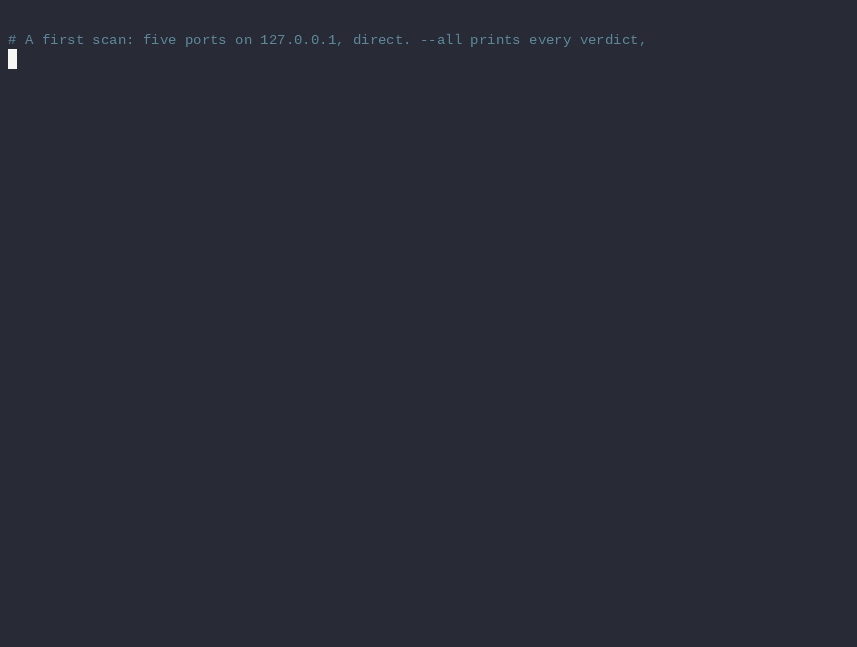
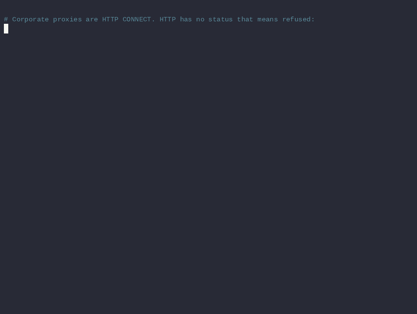
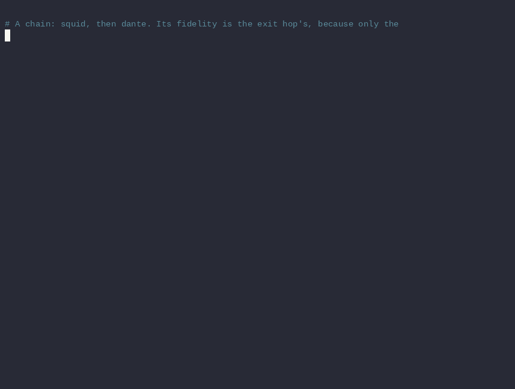
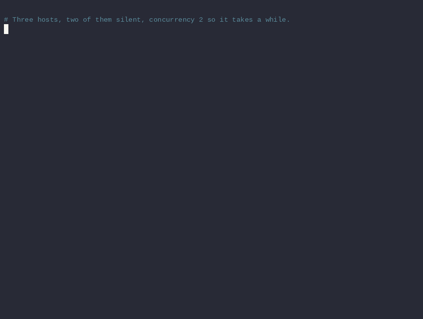
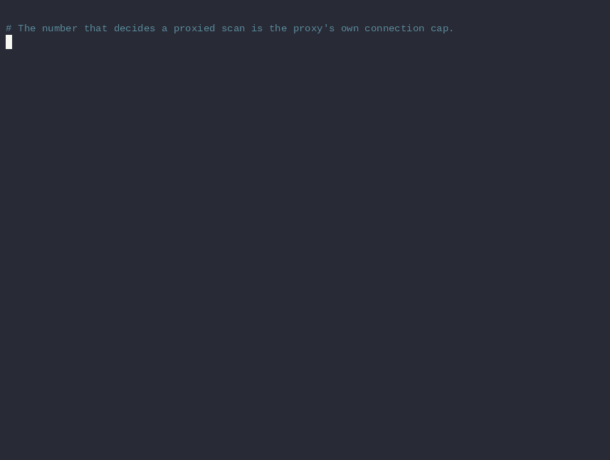

# Learning scanr by using it

Ten use cases, each a real command with its real output. Each step shows what scanr
does that `nmap` does not, and what it leaves to nmap. Everything below was captured on
2026-08-26 against the lab in the next section. Run it yourself and the outputs match
apart from timings, ids, the version banner, and the certificate's fingerprint and dates.
Each use case is also recorded. The animation under its heading is the section's commands
run against the lab; the `▶` link below it is the same recording as an
[asciinema](https://asciinema.org) cast for `asciinema play`.

The claim, up front. A port scan through a proxy is usually untrustworthy and
unrepeatable. The proxy decides what `closed` means, the scanner guesses, and what
survives the engagement is a terminal scrollback. scanr makes every scan leave a record
that states what was run, what answered, what the proxy could not tell you, and what was
never reached. A killed scan resumes at the endpoint, not the host. It is also fast, but
that is a side effect of the design rather than the point. Each use case below shows one
of those properties working, and what nmap does in the same spot.

## The lab

Three loopback services, two closed ports, one unroutable network and four proxies, all
packaged in [`docs/tutorial/`](tutorial/) so you can start without building anything:

```console
$ cd docs/tutorial
$ ./scanr-lab up
scanr-lab: lab is up on 127.0.0.1

  services
    :25025  greets       SMTP-style banner on connect
    :28080  silent       open, volunteers nothing
    :28443  tls 1.2      ALPN h2, http/1.1; self-signed
    :28444  tls 1.0/1.1  the old appliance (use case 9)
    :29000  closed       nothing listening
    :29001  closed       nothing listening

  proxies
    :3128   squid      http connect
    :3129   tinyproxy  http connect
    :3130   3proxy     http connect
    :1081   3proxy     socks5
    :1082   dante      socks5

  next: scanr-lab check  |  scanr-lab tunnel  |  scanr-lab down
```

`./scanr-lab tunnel` adds the `ssh -D` for use case 5, an OpenSSH dynamic forward through
a throwaway `sshd`. `./scanr-lab check` shows a live `up` / `down` for every port.
`./scanr-lab down` stops it all.

`scanr-lab` is a single [`uv`](https://docs.astral.sh/uv/) script, no VM, no root.
`./scanr-lab install` puts it on your PATH as `scanr-lab`; `scanr-lab uninstall` removes
it. The services are `python3 docs/tutorial/lab.py`, standard library only. 25025 greets
on connect like an SMTP server. 28080 accepts and says nothing. 28443 is a TLS 1.2 server
with a self-signed certificate. 28444 answers only TLS 1.0 and 1.1, the old appliance that
use case 9 surveys. Ports 29000 and 29001 have nothing listening. `192.0.2.0/24`
(TEST-NET-1) is never routed, so probes to it time out. The proxies run in rootless
podman from `docs/tutorial/proxies/`: dante (SOCKS5 `:1082`), 3proxy (SOCKS5 `:1081`,
HTTP CONNECT `:3130`), squid (HTTP CONNECT `:3128`), tinyproxy (HTTP CONNECT `:3129`).
Without podman, point the config at any SOCKS5 and HTTP proxy you have.

The configuration below is `docs/tutorial/scanr.toml`. Every command in this guide runs
from that directory.

```toml
# scanr.toml
version = 1

[transports.dante]
type = "socks5"
address = "127.0.0.1:1082"
fidelity = "full"                # you will measure this in use case 5

[transports.exit-b]
type = "socks5"
address = "127.0.0.1:1081"
fidelity = "full"

[transports.corp]
type = "http"
address = "127.0.0.1:3128"

[transports.path]
type = "chain"
hops = ["corp", "dante"]

[transports.spread]
type = "pool"
members = ["dante", "exit-b"]

[transports.tunnel]
type = "socks5"
address = "127.0.0.1:1088"       # ssh -N -D 127.0.0.1:1088 bastion

[targets.lab]
include = ["127.0.0.1"]

[ports.lab]
ports = "25025,28080,28443,29000,29001"

[scans.lab-audit]
description = "The lab hosts through the dante proxy"
transport = "dante"
targets = ["lab"]
ports = ["lab"]
```

## 1. A first scan, and the file it leaves behind



<sub>▶ [`demos/01-first-scan.cast`](tutorial/demos/01-first-scan.cast), `asciinema play` for a real terminal</sub>

```console
$ scanr run --targets 127.0.0.1 --ports 25025,28080,28443,29000,29001 --all --output-dir results
Overview
scan            (ad-hoc)
transport       direct
scope           5 probes (1 targets x 5 ports)
timing          concurrency 512, rate unlimited, connect_timeout 1s
scan id         5d2875ea  seed bf052d2f27c67ba1

Results
127.0.0.1:29000/tcp closed saltd-licensing 0.2ms
127.0.0.1:25025/tcp open 0.1ms 220 mail.lab.internal ESMTP ready..
127.0.0.1:29001/tcp closed 0.2ms
127.0.0.1:28080/tcp open 0.2ms
127.0.0.1:28443/tcp open 0.1ms

Summary
result          completed in 0.05s
states          3 open, 2 closed, 0 filtered, 0 error
probed          5 of 5
record          results/scan-adhoc-2026_08_26T01_53_14Z-5d2875ea.jsonl.gz
```

What to notice:

- The Overview prints the resolved settings and the seed before any traffic. Results
  stream as they arrive, in randomised order; use case 4 shows why the seed matters.
  `--all` shows every state; the default shows open ports only.
- The greeting from 25025 is on the line. Nothing was sent to get it; the service spoke
  first. It is shown as printable ASCII only, because those bytes belong to the scanned
  host and a terminal acts on escape sequences.
- `saltd-licensing` is a guess from `/etc/services`, never a fingerprint.
- The Summary's `record` line names the file. It was `.partial` while the scan ran and
  was renamed when the terminal event was written. A file still called `.partial` means
  the process died.

The same scan in nmap:

```console
$ nmap -sT -Pn -n -p 25025,28080,28443,29000,29001 127.0.0.1
PORT      STATE  SERVICE
25025/tcp open   unknown
28080/tcp open   unknown
28443/tcp open   unknown
29000/tcp closed saltd-licensing
29001/tcp closed unknown
```

Same verdicts; the differential tests in CI hold that true. The difference is what is
left afterwards. `nmap -oX` records what it found. It does not record the resolved
settings that produced it, whether the run finished, or what was never probed. scanr's
record does, unconditionally. The rest of this guide is that record.

## 2. Reading the record


<sub>▶ [`demos/02-record.cast`](tutorial/demos/02-record.cast), `asciinema play` for a real terminal</sub>

```console
$ scanr output verify results/scan-adhoc-2026_08_26T01_53_14Z-5d2875ea.jsonl.gz
results/scan-adhoc-2026_08_26T01_53_14Z-5d2875ea.jsonl.gz
  7 events
  terminal: scan_completed
  3 probe results
  2 further probes collapsed into 1 span(s)

ok — record is complete and internally consistent
```

`verify` checks structure, counts and values. Try to fool it. Drop the row for port
25025 and verify the result:

```console
$ zcat results/scan-*.jsonl.gz | grep -v '"port":25025' > tampered.jsonl
$ scanr output verify tampered.jsonl
tampered.jsonl
  6 events
  terminal: scan_completed
  2 probe results
  2 further probes collapsed into 1 span(s)

  problem: terminal event claims 5 completed probes but 2 probe_result events plus 2 probes across 1 probe_span events present

1 problem(s) found
$ echo $?
2
```

Cut the file off before its last line, as a crash would:

```console
$ zcat results/scan-*.jsonl.gz | head -n -1 > truncated.jsonl
$ scanr output verify truncated.jsonl
  problem: no terminal event — the scan did not finish writing (process died?)
```

The terminal event's counts are the authority and every reader checks against them, so
a record that has lost a result cannot pass as complete. Run `verify` on any record
someone hands you. Exit `2` means the record is bad; `1` means it could not be read.

```console
$ scanr output summarize results/scan-adhoc-2026_08_26T01_53_14Z-5d2875ea.jsonl.gz
results/scan-adhoc-2026_08_26T01_53_14Z-5d2875ea.jsonl.gz
  scan            (ad-hoc)
  started         2026-08-26T01:53:14.715Z  (scanr 1.0.0-rc.5)
  transport       direct via direct (full)
  scope           1 targets x 5 ports = 5 probes
  seed            bf052d2f27c67ba1
  result          scan_completed (natural)
  duration        0.05s
  states          3 open, 2 closed, 0 filtered, 0 error

by host (1 host):
  host               open closed filtered  error  open ports
  127.0.0.1             3      2        0      0  25025 28080 28443
...
```

`results` is the per-endpoint view with filters. Its formats hand work on:

```console
$ scanr output results --states open --format nmap results/scan-*.jsonl.gz
nmap -sV -Pn -n -p 25025,28080,28443 127.0.0.1

$ scanr output results --states open --format list results/scan-*.jsonl.gz | httpx
127.0.0.1:25025
127.0.0.1:28080
127.0.0.1:28443
```

That first line is the intended relationship with nmap. scanr finds what is reachable,
fast and through proxies, and hands the open set to `nmap -sV`, which has twenty years of
service signatures scanr will never duplicate. `-Pn -n` stop nmap repeating the work.

`events` is the file itself. The first line says which build ran on which host:

```json
{"git_commit":"0957b9d00","hostname":"main.trusted.mad.family","pid":3541013,
 "rustc":"rustc 1.98.0 (88d9e12ae 2026-08-18)","scan_id":"5d2875ea","schema_version":2,
 "tool_version":"1.0.0-rc.5","ts":"2026-08-26T01:53:14.715Z","type":"scan_started", ...}
```

and the last line is the terminal event. Its `counts` are the authority on totals. Never
count lines of any one type, since spans collapse repeated outcomes:

```json
{"type":"scan_completed","termination":"natural","graceful":true,"exit_code":0,
 "counts":{"planned":5,"started":5,"completed":5,"abandoned":0,"not_started":0,
           "open":3,"closed":2,"filtered":0,"error":0,"retried":0}, ...}
```

Schema and `jq` recipes: [output-schema.md](output-schema.md).

## 3. Look before you scan


<sub>▶ [`demos/03-plan.cast`](tutorial/demos/03-plan.cast), `asciinema play` for a real terminal</sub>

```console
$ scanr plan lab-audit
Overview
scan            lab-audit
description     The lab hosts through the dante proxy
profile         proxy                                   builtin

Transport
transport       dante (socks5)                          scan.lab-audit
  address       127.0.0.1:1082
  fidelity      full                                    declared in config
dns             auto -> transport (names handed to the proxy to resolve) builtin

Scope
targets         1 (127.0.0.1)
ports           5 (25025,28080,28443,29000-29001)
probes          5
labels          /etc/services (5,863) + builtin (2)     builtin
order           randomized, seed c34fc9e738756cc3       builtin

Timing
concurrency     512                                     builtin.proxy
rate            400/s                                   builtin.proxy
connect_timeout 5s                                      builtin.proxy
proxy_timeouts  connect 3s, handshake 5s                builtin.proxy
retries         1 (timeouts only, delay 250ms)          builtin.proxy

Probing
banner          up to 1024 B, 500ms max wait            builtin
tls probe       off                                     builtin

Output
output          ./scanr-results                         builtin
  format        gzip                                    builtin
  detail        repeated outcomes collapsed             builtin

Projection
rate-bound      ~0.01s at 400/s if every probe answers
timeout-bound   ~10.25s if every probe times out (5s x 2 attempts / 512 in flight)

Host
facts           ephemeral 32768-60999 (28232 ports), tcp_tw_reuse=2 (loopback only), nofile=524288

hint     if loopback proxy `dante` is an `ssh -D` listener, use `--profile ssh` (`ssh-fast` for a nearby server, `ssh-slow` for a high-latency link); general proxy profiles can overwhelm OpenSSH with concurrent connections
```

No traffic. Every value shows the layer it came from (`builtin.proxy`, `scan.lab-audit`,
`cli`), so "why is the rate 400?" is answered on the screen. Read the two projection
lines before a big scan. The same plan for a `/24` × all 65,535 ports:

```console
$ scanr plan --targets 10.0.0.0/24 --ports 1-65535 --transport dante
...
probes          16,776,960
...
Projection
rate-bound      ~11h39m02s at 400/s if every probe answers
timeout-bound   ~3d21h17m if every probe times out (5s x 2 attempts / 512 in flight)
```

The rate cap never binds on a network of silent ports; the timeout does. That is the
number that turns "scan everything" into "top 1,000 first, then the full range on the
hosts that answered". nmap has no equivalent; you find out by waiting.

## 4. Named scans, and getting the same scan twice

Use case 3 ran a scan defined in `scanr.toml`. That file is the point. It is committed
with the engagement, `plan` shows what it resolves to, and the record embeds the
resolved configuration. "What exactly did we run in March" is answered by the file, not
by shell history.

A named scan also names its record. `scanr run internal-web` writes
`scan-internal_web-2026_08_26T01_53_14Z-4a96aca3.jsonl.gz`; an ad-hoc `run --targets …`
writes `scan-adhoc-…`. The scan name identifies the file at a glance, the
`YYYY_MM_DDThh_mm_ssZ` stamp sorts it, and the `scan_id` breaks ties. `scan-*` still
globs them all, and the file's contents remain the authority.

The seed is the other half. Probe order is a seeded permutation of the target × port
matrix. The record has the seed, `--seed` replays it, and `output remainder` (use case 8)
uses it to say which endpoints a killed scan never reached.

## 5. Through a SOCKS5 proxy: know what the proxy can tell you


<sub>▶ [`demos/05-socks5.cast`](tutorial/demos/05-socks5.cast), `asciinema play` for a real terminal</sub>

This is the reason the tool exists. SOCKS5 defines distinct replies for refused,
unreachable and denied, but not every proxy uses them. A proxy that cannot say "refused"
cannot let you tell a closed port from a filtered one. scanr measures it:

```console
$ scanr transport test dante
transport dante (socks5 127.0.0.1:1082)
  reachable         yes
  known-open        open      reply 0x00         2.2ms
  known-closed      closed    reply 0x05         0.8ms
  blackholed        error     reply 0x01         0.4ms   <- expected filtered

  fidelity          full
  This proxy reports refused connections distinctly (0x05), so scanr can
  tell `closed` apart from `filtered` in your results.

  to record this, add to [transports.dante]:
      fidelity = "full"
```

dante answers `0x05` for a refused port and `0x01` for an unreachable one, so `closed` is
real through it. Record the measurement in the config (the lab file already has it) and
the "fidelity not measured" warning goes away. The record then states the fidelity on
every scan, and the Overview shows it next to the transport:

```console
$ scanr run lab-audit --all --output-dir results-dante
Overview
scan            lab-audit
transport       dante (socks5 127.0.0.1:1082)  fidelity full
scope           5 probes (1 targets x 5 ports)
...

Warnings
hint            if loopback proxy `dante` is an `ssh -D` listener, use `--profile ssh` (`ssh-fast` for a nearby server, `ssh-slow` for a high-latency link); general proxy profiles can overwhelm OpenSSH with concurrent connections

Results
127.0.0.1:29001/tcp closed 0.8ms
127.0.0.1:29000/tcp closed saltd-licensing 0.8ms
127.0.0.1:28080/tcp open 0.8ms
127.0.0.1:25025/tcp open 1.0ms 220 mail.lab.internal ESMTP ready..
127.0.0.1:28443/tcp open 0.9ms

Summary
result          completed in 0.06s
states          3 open, 2 closed, 0 filtered, 0 error
probed          5 of 5
```

Same verdicts as the direct scan. Every result in the record carries
`source: proxy_reply`, so the record says the classification is the proxy's assertion.
Through OpenSSH's `ssh -D`, which sends no reply at all for a refused port, the same
scan reports `error` for the two closed ports rather than guessing.

### The proxy everyone actually uses: `ssh -D`

The lab's last transport is an OpenSSH dynamic forward to a throwaway `sshd`
(`ssh -N -D 127.0.0.1:1088 bastion`). That is how most people reach an internal network
in practice. Measure it:

```console
$ scanr transport test tunnel
transport tunnel (socks5 127.0.0.1:1088)
  reachable         yes
  known-open        open      reply 0x00         0.7ms
  known-closed      error     no reply           0.3ms   <- expected closed
  blackholed        filtered  no reply        3012.7ms

  fidelity          open_only
  The known-closed destination produced no usable reply code (the proxy
  may have timed out or closed the connection, which is what OpenSSH's
  `ssh -D` does), so closed and filtered cannot be distinguished.

  to record this, add to [transports.tunnel]:
      fidelity = "open_only"

  If this is an ssh -D listener, use --profile ssh (ssh-fast for a nearby
  server, ssh-slow for a high-latency link).
```

OpenSSH knows the port was refused; its own log says `connect failed: Connection
refused`. Its SOCKS5 layer has no way to say so, and closes the channel without a reply.
Through this proxy a closed port and a firewalled port look identical, and scanr says so
before you spend the scan. Now the scan:

```console
$ scanr run lab-audit --transport tunnel --profile ssh --all --output-dir results-tunnel
Overview
scan            lab-audit
transport       tunnel (socks5 127.0.0.1:1088)  fidelity unknown
scope           5 probes (1 targets x 5 ports)
timing          concurrency 96, rate unlimited, connect_timeout 6s
...

Warnings
warning         result fidelity of proxy `tunnel` has not been measured; closed and filtered may be indistinguishable
                run: scanr transport test tunnel

Results
127.0.0.1:29000/tcp error saltd-licensing 1.0ms
127.0.0.1:28080/tcp open 1.1ms
127.0.0.1:29001/tcp error 1.0ms
127.0.0.1:25025/tcp open 1.1ms 220 mail.lab.internal ESMTP ready..
127.0.0.1:28443/tcp open 1.1ms

Summary
result          completed in 0.05s
states          3 open, 0 closed, 0 filtered, 2 error
probed          5 of 5
```

The open set is exact. The two closed ports are `error`, with the reason in the record,
because `closed` was never observed. The Warnings section flags the unmeasured fidelity
before the first result. Record `fidelity = "open_only"` in the config and it becomes a
statement in every record instead. `--profile ssh` is one of three profiles built for
this proxy. Its listener is local, so the ephemeral-port rate cap a remote proxy needs
does not apply, and its throughput cliffs above ~128 in flight (measured;
[tuning.md](tuning.md)).

Versus nmap. `proxychains nmap` intercepts nmap's sockets with `LD_PRELOAD`, leaks DNS
unless you are careful, fights nmap's parallelism, and gives no way to know whether a
`closed` came from the proxy's reply or from the interception layer's guess.
`nmap --proxies` exists, but its own documentation calls it incomplete. scanr speaks
SOCKS5 itself, resolves hostnames on the proxy side (`dns  auto -> transport` in the
plan), and never records a state it did not observe.

## 6. Through an HTTP CONNECT proxy



<sub>▶ [`demos/06-http-connect.cast`](tutorial/demos/06-http-connect.cast), `asciinema play` for a real terminal</sub>

Corporate proxies are usually HTTP CONNECT, not SOCKS. scanr supports them with the same
config keys, and the measurement tells you the cost up front:

```console
$ scanr transport test corp
transport corp (http 127.0.0.1:3128)
  reachable         yes
  known-open        open      status 200         0.7ms
  known-closed      error     status 503         0.5ms   <- expected closed
  blackholed        error     status 503      2396.8ms   <- expected filtered

  fidelity          open_only
  This HTTP CONNECT proxy answered a known-closed destination with status
  503. HTTP standardises no status meaning refused, so scanr records
  non-open results through it as `error` with source `proxy_reply` rather
  than guessing `closed` or `filtered`.
```

HTTP has no status that means "refused". squid says `503` for both a refused and an
unreachable destination; tinyproxy says `500` for both; 3proxy `502`. So through an HTTP
proxy every non-open port is `error`, and the run's Warnings section says so before the
first result:

```console
$ scanr run lab-audit --transport corp --all --output-dir results-corp
Overview
scan            lab-audit
transport       corp (http 127.0.0.1:3128)  fidelity open_only
...

Warnings
warning         proxy `corp` is an HTTP CONNECT proxy, which has no status meaning refused: closed and filtered are indistinguishable through it, so non-open results will be `error`

Results
127.0.0.1:29001/tcp error 0.8ms
127.0.0.1:29000/tcp error saltd-licensing 0.8ms
127.0.0.1:28080/tcp open 0.5ms
127.0.0.1:25025/tcp open 0.5ms 220 mail.lab.internal ESMTP ready..
127.0.0.1:28443/tcp open 0.4ms

Summary
result          completed in 0.06s
states          3 open, 0 closed, 0 filtered, 2 error
probed          5 of 5
```

The open set is exact, which for most engagements is what matters. The record keeps the
status line in each error's `reason`.

## 7. Chains and pools



<sub>▶ [`demos/07-chain-pool.cast`](tutorial/demos/07-chain-pool.cast), `asciinema play` for a real terminal</sub>

A chain goes through several proxies in order; an HTTP hop can sit in front of a SOCKS5
one. Its fidelity is the exit hop's, because only the last CONNECT names the destination
and its reply comes back untouched:

```console
$ scanr transport test path
transport path (chain 127.0.0.1:1082)
  known-open        open      reply 0x00         1.7ms
  known-closed      closed    reply 0x05         0.9ms
  fidelity          full
```

squid then dante is `full`, even though squid alone is `open_only`.

A pool spreads probes across proxies, which multiplies both the proxies' connection caps
and your local ephemeral-port budget. It assigns each endpoint to a member by hash, so a
rerun goes the same way. Every result names its member:

```console
$ scanr run lab-audit --transport spread --all --no-spans --output-dir results-pool
Overview
scan            lab-audit
transport       spread (pool of 2 across dante, exit-b)  fidelity full
scope           5 probes (1 targets x 5 ports)
...

$ scanr output results --format json results-pool/scan-*.jsonl.gz | jq -c '{port, state, via}'
{"port":25025,"state":"open","via":"exit-b"}
{"port":28080,"state":"open","via":"dante"}
{"port":28443,"state":"open","via":"exit-b"}
{"port":29000,"state":"closed","via":"dante"}
{"port":29001,"state":"closed","via":"exit-b"}
```

`via` is what makes a mixed pool interpretable. If one member is broken, its share of
results says so instead of looking like a flaky network. A pool is not failover. A dead
member fails its share rather than rerouting, because rerouting would make `via` a lie.

## 8. Interruption, and resuming exactly



<sub>▶ [`demos/08-interrupt.cast`](tutorial/demos/08-interrupt.cast), `asciinema play` for a real terminal</sub>

A scan of three hosts, two of them silent, at concurrency 2 so it takes a while. Ctrl-C
after a second and a half:

```console
$ scanr run --targets 127.0.0.1,192.0.2.1,192.0.2.2 --ports 25025,28080,29000,80,443,8080 \
    --all --concurrency 2 --connect-timeout 2s --seed 7 --no-spans --output-dir results-int
Overview
scan            (ad-hoc)
transport       direct
scope           18 probes (3 targets x 6 ports)
timing          concurrency 2, rate unlimited, connect_timeout 2s
scan id         d65f8c99  seed 0000000000000007

Results
^C
interrupt: no new probes will start; draining in-flight work (interrupt again to exit immediately)
192.0.2.1:80/tcp filtered http 2001.0ms
127.0.0.1:8080/tcp closed webcache 0.1ms
127.0.0.1:443/tcp closed https 0.0ms
127.0.0.1:29000/tcp closed saltd-licensing 0.0ms
192.0.2.2:443/tcp filtered https 2000.8ms

Summary
result          interrupted in 2.00s
states          0 open, 3 closed, 2 filtered, 0 error
probed          5 of 18
abandoned       2 probes were started but abandoned mid-flight
not started     11 probes were never started
record          results-int/scan-adhoc-2026_08_26T02_04_48Z-d65f8c99.jsonl.gz
$ echo $?
130
```

The first Ctrl-C drains what is in flight, bounded by the connect timeout; a second
exits at once. Either way the record is finalised and `verify` passes on it. The
Summary's three buckets sum to the plan: 5 completed, 2 abandoned (issued, may have
touched the network), 11 never started.

```console
$ scanr output remainder results-int/scan-*.jsonl.gz
# resumed-from: d65f8c99
127.0.0.1:80
127.0.0.1:25025
127.0.0.1:28080
192.0.2.1:443
...
13 of 18 endpoints were not probed; re-run exactly those with:
  scanr output remainder results-int/scan-adhoc-2026_08_26T02_04_48Z-d65f8c99.jsonl.gz | scanr run --pairs -

$ scanr output remainder results-int/scan-*.jsonl.gz | scanr run --pairs - --all --connect-timeout 1s --output-dir results-resumed
Overview
scan            (ad-hoc)
scope           13 probes (3 targets x 6 ports)
...

Results
127.0.0.1:28080/tcp open 0.1ms
127.0.0.1:25025/tcp open 0.1ms 220 mail.lab.internal ESMTP ready..
...

Summary
result          completed in 2.25s
states          2 open, 1 closed, 10 filtered, 0 error
probed          13 of 13

$ scanr output verify results-resumed/scan-*.jsonl.gz
  terminal: scan_completed
  resumed from scan d65f8c99
  ...
ok — record is complete and internally consistent
```

Exactly the 13 endpoints that were outstanding, not the whole of any host. The second
record names the first, so the two are one scan for anyone reading them later. The
abandoned probes are included because whether they reached the network is unknown.

nmap's `--resume` works from its own normal/greppable output and resumes at host
granularity. Endpoints already finished on a partly scanned host are done again, and
nothing links the two outputs.

## 9. What a service says: banners, and the one active probe


<sub>▶ [`demos/09-tls.cast`](tutorial/demos/09-tls.cast), `asciinema play` for a real terminal</sub>

scanr reads banners by default. They cost the target nothing beyond the connection the
scan already made; the service writes its greeting whether or not anyone reads it. Only
services that speak first have one: SSH, SMTP, FTP, POP3, IMAP, MySQL. HTTP and anything
behind TLS say nothing, and the record distinguishes "said nothing" from "nothing there".

For those, `--tls` sends one fixed ClientHello and records what comes back. It is off by
default because it is the only thing scanr ever sends to a service. The record states
what was sent either way:

```console
$ scanr run --targets 127.0.0.1 --ports 25025,28080,28443 --tls --output-dir results-tls
127.0.0.1:25025/tcp open 0.1ms 220 mail.lab.internal ESMTP ready..
127.0.0.1:28080/tcp open 0.1ms tls no reply
127.0.0.1:28443/tcp open 0.1ms tls1.2 h2 cn=lab.internal self-signed sha256:7dc3c9a4

$ scanr output results --format json results-tls/scan-*.jsonl.gz \
    | jq -c 'select(.tls.negotiated != null) | {port, cn: .tls.cert.subject_cn, expires: .tls.cert.not_after, alpn: .tls.alpn, cipher: .tls.cipher_name}'
{"port":28443,"cn":"lab.internal","expires":"2026-09-26T01:43:02Z","alpn":"h2","cipher":"ECDHE-ECDSA-AES256-GCM-SHA384"}
```

Three ports, three different answers. 25025 gave a greeting and was never probed; a
service that spoke first is not TLS. 28080 closed on the hello (`tls no reply`). 28443
returned its certificate, cipher and ALPN. The record holds what scanr read from the
leaf under `tls.cert` (subject, issuer, alternative names, validity window, key type)
and the DER itself for `openssl x509` or `tlsx`. Read, never verified. The line says
`self-signed`, not `untrusted`, because trust is a policy scanr does not have.

The hello offers TLS 1.3 and 1.2, and scanr reads either. On a 1.3 server it finishes
the key exchange and decrypts the certificate rather than stopping at the version. The
scan's config event says `"tls": {"enabled": true, "offered": "1.3,1.2", "sent_bytes": 218}`;
with `--tls` off it says `"sent_bytes": 0`. The exact 218 bytes are listed in
[security.md](security.md).

### Which SSL/TLS versions: the old appliance

A server answers a hello with the highest version it shares, never the oldest it still
accepts. One hello cannot tell you whether a box still speaks SSLv3, which you need to
know before you can connect to it with a modern client. `--tls-versions` asks each
version for itself, on its own connection with a hello of that era. Port 28444 is the
lab's old appliance; 28443 is the modern server, for contrast:

```console
$ scanr run --targets 127.0.0.1 --ports 28443,28444 --tls --tls-versions --output-dir results-ver
127.0.0.1:28443/tcp open 0.1ms tls1.2 h2 cn=lab.internal self-signed sha256:7dc3c9a4 versions:1.2..1.2
127.0.0.1:28444/tcp open 0.1ms tls alert protocol_version legacy-only:tls1.1
```

28443 refused the survey's older hellos and speaks only 1.2 (`versions:1.2..1.2`). 28444
rejected the main 1.3/1.2 hello outright, hence the alert, but answered the 1.0 and 1.1
hellos and nothing newer. That is `legacy-only:tls1.1`, a server no current browser or
default `openssl` will connect to. The record says which versions answered and what it
takes to reach it:

```console
$ scanr output results --format json results-ver/scan-*.jsonl.gz \
    | jq -c 'select(.tls.versions.legacy_only) | {port, newest: .tls.versions.newest, advice: .tls.versions.advice}'
{"port":28444,"newest":"1.1","advice":"TLS 1.0/1.1 only: browsers refuse it; use openssl s_client -tls1_1 (or -tls1) with -cipher DEFAULT:@SECLEVEL=0, or curl --tls-max 1.1"}

$ scanr output results --format json results-ver/scan-*.jsonl.gz \
    | jq -c 'select(.port==28444) | .tls.versions | {ssl2:.ssl2.accepted, ssl3:.ssl3.accepted, "1.0":."1.0".accepted, "1.1":."1.1".accepted, "1.2":."1.2".accepted}'
{"ssl2":false,"ssl3":false,"1.0":true,"1.1":true,"1.2":false}
```

`advice` names the tool and flag that still reach this host, so you do not have to work
it out. The survey costs up to five extra connections per silent open port
(`.tls.versions.connections`), so it is opt-in. `--tls` records the version the server
prefers; `--tls-versions` records the whole range it accepts. It is still all reading.
No cipher is exercised, no handshake completed. Enumerating every cipher suite is
`testssl.sh`'s job, at dozens of connections per port; scanr stops at the version range
and the certificate.

nmap `-sV` does far more with the open ports themselves. That is where use case 2's
`--format nmap` sends them.

## 10. Tuning: the proxy is the limit, not scanr



<sub>▶ [`demos/10-calibrate.cast`](tutorial/demos/10-calibrate.cast), `asciinema play` for a real terminal</sub>

Concurrency and rate are yours to set, and the plan shows them. The number that decides
whether a proxied scan succeeds is usually the proxy's own connection cap. `--calibrate`
measures it by reproducing a scan's churn:

```console
$ scanr transport test exit-b --calibrate
transport exit-b (socks5 127.0.0.1:1081)
  ...
  concurrency
    at 8              32 probes,   0 refused      0%
    at 16             64 probes,   0 refused      0%
    at 32            128 probes,  13 refused     10%
  Concurrency 16 was clean; it began refusing above that. Treat 16 as a
  conservative ceiling — a real scan may tolerate somewhat more, but
  past the limit probes are recorded as `error` rather than as port
  verdicts. This proxy has a connection cap, and raising it there (for
  example 3proxy's `maxconn`) is usually the better fix.
```

That is 3proxy at its default `maxconn 100`. Seven built-in profiles cover the common
shapes (`proxy`, `proxy-careful`, three for `ssh -D`, `direct`, `direct-fast`);
[tuning.md](tuning.md) has the measurements behind them.

On its own engine, direct, scanr is not the bottleneck. Same terms for both tools:
unprivileged connect scans, loopback `/24`, every port refused except the real listeners,
nmap 7.92 at `-T5 --min-rate 10000 --max-retries 0 -Pn -n`, 64-core machine.

| | probes | scanr, default profile | nmap `-T5` | ratio |
|---|---|---|---|---|
| `/24` × 1,000 ports | 256,000 | **0.40 s** (~640,000/s) | 4.82 s | 12× |
| `/24` × 10,000 ports | 2,560,000 | **4.3 s** (~600,000/s) | 48.4 s | 11× |

Both found the same open ports (259 and 515). scanr used 18 MB resident against nmap's
105 MB, and the 2.56M-probe record is 36 KB. Through a proxy neither tool's engine
matters; the proxy's cap and the network's RTT set the rate. That is why the tool is
built around the measurements above.

## 11. Trusting the result

- `output verify` on every record you act on, or receive.
- Credentials never enter a record or an error message. scanr refuses inline passwords
  in config rather than warning about them, and creates the record mode 0600.
- Every claim in this guide is backed by a named test, a corpus record or a measurement:
  [evidence.md](evidence.md). What 1.x promises to keep stable: [stability.md](stability.md).

## What you got that nmap would not have given you

| use case | nmap | scanr |
|---|---|---|
| 1, 2 · the scan and its record | verdicts in `-oX`/`-oG`; no resolved settings, no statement that the run finished | a record with the resolved config, a terminal event with authoritative counts, and `verify` to hold it to them |
| 3 · before scanning | nothing; you find out by waiting | `plan`: every value with its source layer, both duration bounds, warnings |
| 4 · repeating a scan | shell history | a committed config, a recorded seed, provenance on every field |
| 5 · SOCKS5 | `proxychains` interception; a `closed` you cannot attribute | native SOCKS5, measured fidelity, `source: proxy_reply` on every result, `error` rather than a guess |
| 6 · HTTP CONNECT | not really; `--proxies` is documented as incomplete | native, honest about the protocol's limit, exact open set |
| 7 · several proxies | one at a time | chains with the exit hop's fidelity; pools with `via` on every result |
| 8 · interruption | `--resume` at host granularity from its own output | exact endpoint remainder, piped straight back in, records linked |
| 9 · what a service says | `-sV`, far more, actively | passive banners by default; one documented ClientHello (TLS 1.3 and 1.2) on request; `--tls-versions` names a server only an old client can reach and how to reach it; then `--format nmap` hands the open set to `-sV` |
| 10 · limits | adaptive timing hides them | measured proxy caps, explicit knobs, and the numbers on the page |
| 11 · trust | nothing | credentials never recorded, mode 0600, every claim mapped to a test |

## Where next

[getting-started.md](getting-started.md) is the short path from install to a verified
record. [cli.md](cli.md) lists every flag. [transports.md](transports.md) has the
measured behaviour of real proxies. [troubleshooting.md](troubleshooting.md) is keyed to
the warnings the tool emits.
